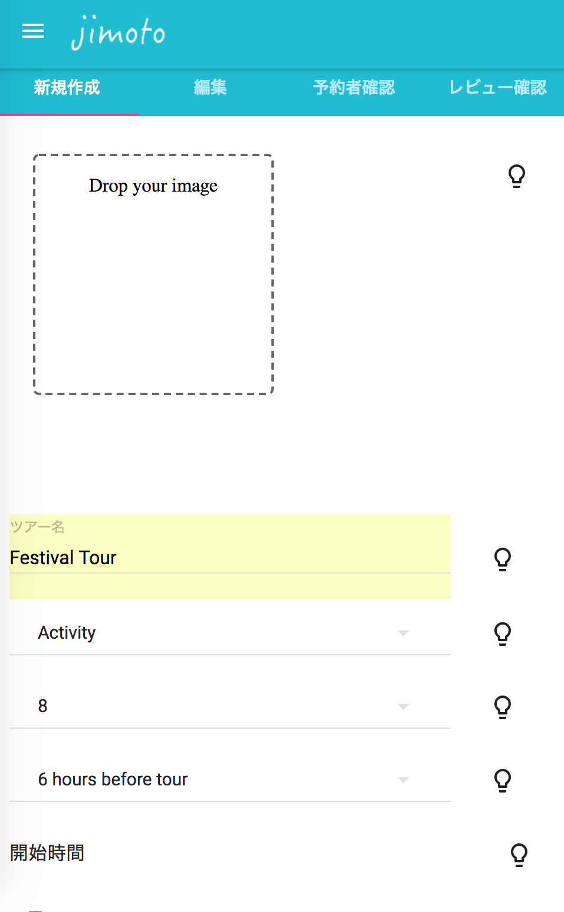

## Project

**_Jimoto_**, which is a **local tour providing platform** based in Tokyo.

## Concept

Local guides can create their own unique tours like "Fish market tour", "Amine tour", and "Night walking tour" etc through our platform.
Travelers from outside of Japan get to book a tour they are interested in immediately, share the tour and divide the guide fees with others, and enjoy the sightseeing with them.

  

## Motivation

**"Give strangers from overseas opportunities to let them enjoy their trip more and mingle with local people"**

This is our original motivation we had.
But we found a problem in this tourism market.

**Problem:**
Local tour is too expensive. (8h walking tour costs $70 on average for each participant)

**Our solution:**
Make a platform you can share local tours with other travelres to split the price

We assume the price could be 1/4 ~ 1/5 compared to exisiting price.

## When We worked on
2016/07 ~ 2018/05 (1y10m)

## Target Users

- Guides: Local Japanese who started their career as tour guides recently
- Participants: Non-Japanese younger travelers who can't speak Japanese, want to join a tour to explore Japan especially Tokyo.

## Interviews

We had interviews with a lot of travelers and guides multiple times to improve our concept.

1. More than 100 travelers in Japan (in Shinjuku-gyoen, Ueno park)
2. More than 20 local Japanese 

## Feature

This platform has useful functionalities.

  
   
  

### 1. Authentication

A person who wants to be a guide/participant can sign up and log in.
When you sign up, you will receive an confirmation email to complete your registeration.

  
   

### 2. Create your tour

A person who want to be a guide can create a tour on our platform.

- Title
- Category
- Start time
- Schedule
- Description
- Booking deadline
- Maximum number of participants
- Minimum number of participants
- Quiestion you want to ask when user book the tour

  
   
  

### 3. Manage your tour

After you create your own tour, you can manage your tour.
It has some convenient functionalities.

- The number of particiapants joining a tour
- The personal information of each participant
- The detail of your tour
- Edit/Delete your tour
- Public/Draft your tour 

  
  

### 4. Contact tour participants

A guide get to contact participants on our platform after they reserve the tour.

- Mail to all participants joining a specific tour
- Mail to one participant joining a specific tour

  

### 5. Book a tour

A person who wants to participate a tour can book that immediately. It takes only one minute to book.

1. Sign up / log in
2. Fill out your personal information
3. Read the notice
4. Receive a booking confirmation email

  
   
  

### 6. Check your review

A user can review the tour after he/she participantes.
After he/she review the tour, the tour guide can see the review.

  
   

## Environment

- HTML, CSS, Sass
- Javascript, React, Redux
- Ruby
- postogreSQL
- Material UI, Sketch
- Webpack

## Promotion

- Tripadvisor
- SEO

 

## Community

We used to organize a big community for local Japanese guides.
400 Japanese guides registered this community.
We organized events once a month regularly, which contents were decided depending on their requests.

ex  Ryogoku Retro Walking Event
    原宿＆表参道　下見見学会
    ガイド交流会

 

## Team

- 2 engineers (1 for frontend, 1 for backend)
- 1 CS
- 2 helpers for developments

## License

This project is licensed under the MIT License

